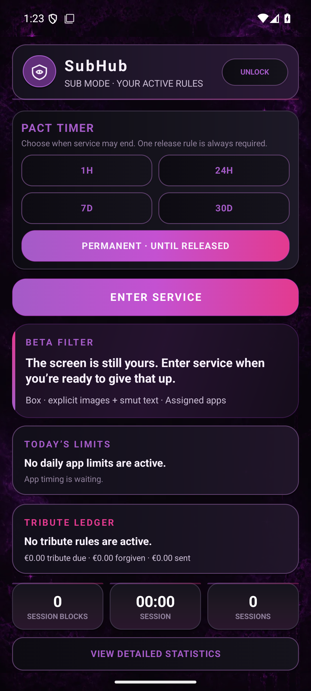

<p align="center">
  
</p>

<p align="center">
  <strong>Private control. Beautifully enforced.</strong><br />
  A consensual Android control space for live censoring, app limits, and an optional tribute wallet.
</p>

<p align="center">
  
  
  
  
</p>

<p align="center">
  <a href="#the-handoff">The handoff</a> ·
  <a href="#the-control-suite">Control suite</a> ·
  <a href="#censor">Censor</a> ·
  <a href="#limits">Limits</a> ·
  <a href="#wallet">Wallet</a> ·
  <a href="#privacy--boundaries">Privacy</a> ·
  <a href="#build--release">Build</a>
</p>

<p align="center">
  <a href="https://github.com/bozo-industries/SubHub/releases/latest"><strong>Download the latest signed release</strong></a>
  &nbsp;·&nbsp;
  <a href="docs/ui-map.md"><strong>Explore every screen</strong></a>
</p>

<p align="center"></p>

## The handoff

**Make the rules. Lock the page. Hand it over.**

<table>
  <tr>
    <td width="44%" align="center">
      
    </td>
    <td width="56%">
      <ol>
        <li><strong>Shape the scene in Dom mode.</strong><br />Choose only the modules the relationship uses, assign apps, set limits, and bound every tribute rule.</li>
        <li><strong>Choose the pact.</strong><br />Pick 1 hour, 24 hours, 7 days, 30 days, or Permanent before entering service.</li>
        <li><strong>Lock the controls.</strong><br />Sub mode hides configuration and leaves one clean Home surface.</li>
        <li><strong>Review together.</strong><br />Session time, blocks, limits, and the tribute ledger stay visible without exposing settings.</li>
      </ol>
    </td>
  </tr>
</table>

Opening SubHub does **not** create a session. A session begins when service starts, persists while service is active, and ends only when service is released.

> **18+ project.** Real-device examples show filtering in an adult-content context. Detected content remains covered in the screenshots.

<p align="center"></p>

## The control suite

| | **Censor** | **Limits** | **Wallet** |
|---|---|---|---|
| **The rule** | Eyes down. Selected temptations stay covered. | Time goes where the agreement puts it. | Every enabled slip lands in the ledger. |
| **The control** | Visual categories, explicit text, style, color, border, and capture path. | Per-app allowances, a shared allowance, or both. | Event prices, batching, grace, caps, correction window, and checkout. |
| **The handoff** | Live overlays follow assigned apps and tracked regions. | A spent app is returned to Android Home. | Sub mode may settle the balance but cannot rewrite the rules. |

<p align="center">
  
  &nbsp;
  
  &nbsp;
  
</p>

Each area is independent. Disable Censor, Limits, or Wallet and it disappears from the navigation and stops participating in service.

<p align="center"></p>

## Censor

### Live, local, and app-aware

<p align="center">
  
  &nbsp;&nbsp;
  
</p>

- **App Mode is the default.** Android Accessibility supplies foreground-app awareness and visible-text geometry without asking for a new screen-capture approval every session.
- **Screen Capture remains optional.** MediaProjection expands visual analysis when the couple wants that path.
- **Assigned means assigned.** Censoring sleeps outside the chosen app scope.
- **Tracked means stable.** Regions follow ordinary motion and scrolling; repeated frames do not become new blocks or fresh tribute events.
- **Image and text work concurrently.** High and Ultra keep the local pipelines warm and prioritize fast overlay updates.

### A look for every rule

Blackout, Censor Bar, Blur, Pixelate, Custom Image, TV Static, Glitch, Privacy Tape, and Error Popup share one tracked-overlay pipeline. Style cards preview the result before service begins; effect-specific colors and classic, gradient, glow, or rainbow borders complete the look.

| Preset | Best for |
|---|---|
| **Low** | Battery-first sessions and slower hardware. |
| **Medium** | Balanced everyday use. |
| **High** | More frequent analysis and better small-region coverage. |
| **Ultra** | Maximum local compute, concurrent image/text work, and the fastest refresh path on flagship devices. |

<p align="center"></p>

## Limits

Assign **Censor**, **Limit**, or both to each app. Limited apps can receive their own daily allowance, draw from one shared allowance, or use both boundaries together. Usage resets at local midnight; reaching the active allowance sends the app back to Android Home.

<p align="center">
  
  &nbsp;&nbsp;
  
</p>

<p align="center"></p>

## Wallet

The local tribute ledger can count only the slips a couple deliberately enables:

- a **new temptation** after every configured number of stable censors;
- **lingering** on one still screen for the full configured time;
- tapping a visible censor;
- opening an assigned app;
- or a rate-limited Hardcore tamper signal.

Every event is gated behind active service. Nothing is added merely because SubHub is open. The Dom controls price, batching, grace, daily and weekly caps, and the correction window; Sub mode can review and settle the balance without editing those terms.

<p align="center">
  
  &nbsp;&nbsp;
  
</p>

PayPal merchant credentials belong to the installation and are entered only in Dom mode. Secrets are encrypted with Android Keystore. Saved-wallet and automatic Hardcore checkout are separate opt-ins and remain subject to PayPal account eligibility.

<p align="center"></p>

## Dom mode / Sub mode

<table>
  <tr>
    <td width="50%">
      <h3>Dom mode</h3>
      <ul>
        <li>All settings, app assignments, caps, and payment controls.</li>
        <li>PIN-protected configuration boundary.</li>
        <li>Clean module toggles: use any combination of Censor, Limits, and Wallet.</li>
        <li>Optional Hardcore Mode and Device Admin setup.</li>
      </ul>
    </td>
    <td width="50%">
      <h3>Sub mode</h3>
      <ul>
        <li>One focused Home page with active rules only.</li>
        <li>Pact choice, service control, live session state, and statistics.</li>
        <li>Allowance status and enabled Wallet checkout.</li>
        <li>No configuration fields, save buttons, or administrative noise.</li>
      </ul>
    </td>
  </tr>
</table>

<p align="center">
  
  &nbsp;&nbsp;
  
</p>

<p align="center"></p>

## Privacy & boundaries

### What stays private

- Visual inference and text classification run on the device.
- Captured frames are processed in memory; SubHub provides no remote content-analysis service.
- Merchant secrets are encrypted locally and never belong in the APK or repository.
- Censor, Limits, and Wallet can each be removed from the experience entirely.

### What Android still controls

- Android may require explicit approval for Accessibility, screen capture, overlays, notifications, or Device Admin.
- Hardcore Mode adds platform-supported friction; it is not an unbreakable device-security boundary.
- Device Admin declares no wipe, camera, password, lock-screen, or monitoring policy.
- The device owner, safe mode, ADB, or uninstall after Device Admin removal can still defeat the app.
- Tamper events are explicit and rate-limited, and never create a tribute while service is off.

<p align="center"></p>

## Build & release

### Requirements

- Android Studio or JDK 17
- Android SDK 35
- Android 8.0+ device or emulator

```powershell
.\gradlew.bat testDebugUnitTest assembleDebug
```

For a focused device pass:

```powershell
.\gradlew.bat connectedDebugAndroidTest
```

The editable Android source lives under `app/src/main/java/com/subhub/app/`; the package is `com.subhub.app`. Correctly versioned tags trigger the release workflow, which builds, signs, verifies, and publishes the universal and ABI-specific APKs with checksums.

<details>
<summary><strong>Project map and deeper documentation</strong></summary>

```text
app/src/main/java/com/subhub/app/   Human-editable Android source
app/src/main/res/                   SubHub interface and resources
app/src/androidTest/                Device and UI contracts
app/src/test/                       Local logic contracts
docs/                               Architecture, safety, QA, and integration notes
scripts/                            Repeatable workspace and build helpers
```

- [Architecture](docs/architecture.md)
- [Complete device-rendered UI map](docs/ui-map.md)
- [Device smoke test](docs/device-smoke-test.md)
- [Visual audit](docs/visual-parity.md)
- [PayPal integration](docs/paypal-penance.md)

</details>

<p align="center"></p>

<p align="center">
  <strong>SubHub</strong><br />
  Set the terms. Enter service. Keep the handoff clean.
</p>
