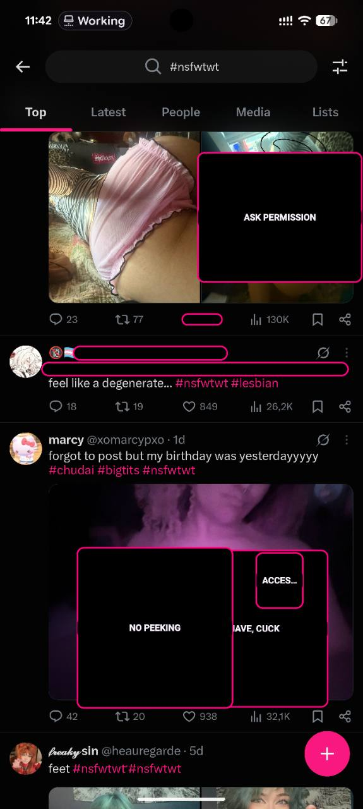
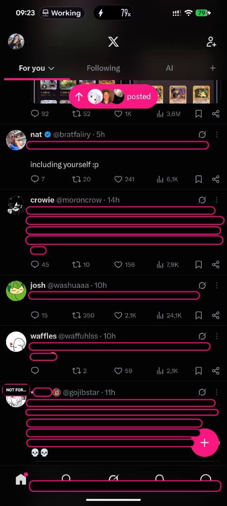
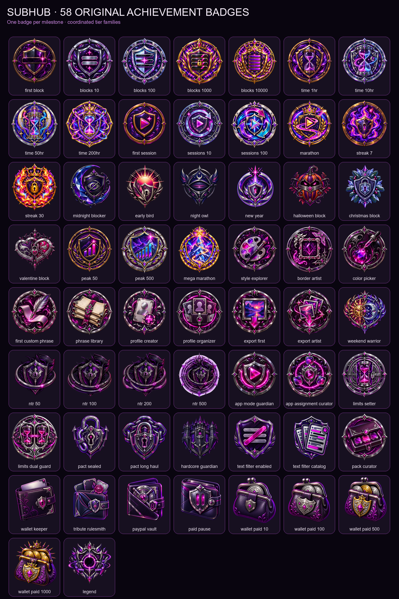

<p align="center">
  
</p>

<p align="center">
  <strong>Set the terms. Hand over control.</strong><br />
  A private Android control space for live censoring, app limits, and an optional tribute wallet.
</p>

<p align="center">
  
  
  
</p>

<p align="center">
  <a href="https://github.com/bozo-industries/SubHub/releases/latest"><strong>Download</strong></a>
  &nbsp;·&nbsp;
  <a href="#control-suite"><strong>Features</strong></a>
  &nbsp;·&nbsp;
  <a href="#build"><strong>Build</strong></a>
</p>

<p align="center"></p>

## One clean handoff

Dom mode holds every rule. Sub mode keeps only the active scene: choose a service duration, enter service, and see the current limits, ledger, session, and milestones without exposing configuration.

| **Dom mode** | **Sub mode** |
|---|---|
| Configure modules, assigned apps, limits, censor appearance, Wallet rules, and Android access. | Start service, follow the timer, review active rules, and settle an enabled Wallet balance. |
| Protected by the controller PIN. | One focused Home surface with no edit fields. |

A session begins when service starts—not when SubHub opens—and persists until service ends.

<p align="center"></p>

## Control suite

<table>
  <tr>
    <td width="33%" valign="top"><h3>Censor</h3>On-device image and explicit-text detection with tracked overlays, configurable looks, and assigned-app scope.</td>
    <td width="33%" valign="top"><h3>Limits</h3>Individual and shared daily allowances. When time is spent, SubHub returns the assigned app to Home.</td>
    <td width="33%" valign="top"><h3>Wallet</h3>Optional local tribute rules, bounded balances, PayPal settlement, and confirmed-payment milestones.</td>
  </tr>
</table>

### Subliminal Messaging

Faint randomized phrases can follow service through separately assigned apps. Obedience, focus, beta/cuck, findom, and custom phrase packs run through one touch-through Accessibility overlay—without waking the image detector. Presence, timing, text size, and voice are configured in Dom mode; Sub mode sees only the active summary.

Each module is independent. Disable one and it stops participating in service. Subliminal Messaging has its own per-app assignment and does not require Censor, Limits, or Wallet.

<p align="center">
  
  &nbsp;&nbsp;
  
</p>

<p align="center"></p>

## Live censoring

<p align="center">
  
  &nbsp;&nbsp;
  
</p>

- **App Mode by default.** Accessibility supplies foreground-app awareness and visible-text geometry without a new capture prompt every session.
- **Screen Capture when wanted.** MediaProjection remains an explicit alternate path.
- **Assigned means assigned.** Filtering sleeps outside the configured app scope.
- **Tracked means stable.** Censors follow scrolling and ordinary motion; repeated frames do not create new events.
- **One render system.** Blackout, Blur, Pixelate, Custom Image, TV Static, Glitch, Privacy Tape, and Error Popup share the tracked overlay pipeline.

Low through Ultra presets trade battery for analysis frequency. High and Ultra keep the local pipelines warm and run image and text work concurrently.

<p align="center"></p>

## Limits & Wallet

Assign Censor, Limit, or both to each app. Per-app allowances may differ, and an optional shared allowance can govern the whole set. Usage resets at local midnight.

Wallet rules can count only deliberately enabled events: a new stable temptation, lingering on one still screen, tapping a visible censor, opening an assigned app, or a rate-limited Hardcore tamper signal. Every event is gated behind active service and the Wallet master switch.

The Dom sets prices, batching, grace, correction time, and daily or weekly caps. PayPal merchant credentials and saved-wallet tokens are encrypted with Android Keystore and stay bound to the selected Sandbox or Live environment.

<p align="center">
  
  &nbsp;&nbsp;
  
</p>

<p align="center"></p>

## Milestones

SubHub includes original illustrated achievements across censoring, protected time, sessions, streaks, customisation, App Mode, limits, service locks, Hardcore Mode, confirmed Wallet payments, and subliminal impressions. Related tiers keep one visual family and grow richer as the target rises.

<details>
<summary><strong>Open the complete badge collection</strong></summary>
<br />

</details>

<p align="center"></p>

## Boundaries

- Detection and text classification run on-device; frames are processed in memory.
- Android remains the authority for Accessibility, screen capture, overlays, notifications, and Device Admin.
- Hardcore Mode adds platform-supported friction. It is not an unbreakable device-security boundary.
- Device Admin requests no wipe, camera, password, force-lock, or login-monitoring policy.
- Censor, Limits, and Wallet can each be removed from the experience.

<p align="center"></p>

## Build

Requirements: JDK 17, Android SDK 35, and Android 8.0 or newer.

```powershell
.\gradlew.bat testDebugUnitTest lintDebug assembleDebug
```

Editable source lives under `app/src/main/java/com/subhub/app/`. Versioned tags build, sign, verify, and publish universal and ABI-specific APKs with checksums.

<details>
<summary><strong>Project documentation</strong></summary>

- [Architecture](docs/architecture.md)
- [Device smoke test](docs/device-smoke-test.md)
- [Visual audit](docs/visual-parity.md)
- [PayPal setup](docs/paypal-setup.md)
- [PayPal settlement](docs/paypal-penance.md)
- [Client-only roadmap](docs/client-only-roadmap.md)

</details>

<p align="center"></p>

<p align="center">
  <strong>SubHub</strong><br />
  Private control. Clearly handed over.
</p>
