<p align="center">
  
</p>

<p align="center">
  <strong>Set the terms. Hand over control.</strong><br />
  A private Android control space for live censoring, app limits, an optional tribute wallet, and atmosphere.
</p>

<p align="center">
  
  
  
</p>

<p align="center">
  <a href="https://github.com/confiteor48/SubHub/releases/latest"><strong>Download</strong></a>
  &nbsp;·&nbsp;
  <a href="#features"><strong>Features</strong></a>
  &nbsp;·&nbsp;
  <a href="#how-service-works"><strong>How it works</strong></a>
  &nbsp;·&nbsp;
  <a href="docs/screenshots/ui-map/README.md"><strong>Gallery</strong></a>
  &nbsp;·&nbsp;
  <a href="docs/marketing/README.md"><strong>Media kit</strong></a>
  &nbsp;·&nbsp;
  <a href="#build"><strong>Build</strong></a>
</p>

## Overview

SubHub brings the rules, active session, and progress into one Android app. Choose the features that participate, configure them in Dom mode, and hand over to the focused Sub experience.

| Feature | What it does |
|---|---|
| [Censor](#censor) | On-device image and explicit-text detection with configurable overlays. |
| [Limits](#limits) | Individual and shared daily app allowances. |
| [Wallet / Tribute](#wallet--tribute) | Optional tribute rules, bounded balances, and PayPal settlement. |
| [Atmosphere](#atmosphere) | Subliminal Messaging and Popup Storm, configured independently. |
| [Studio / Pack Maker](#studio--pack-maker) | Create, edit, share, and apply portable arrangements. |
| [Milestones](#milestones) | Session statistics and illustrated achievements. |

<p align="center"></p>

## Features

### Censor

- **App Mode by default.** Accessibility supplies foreground-app awareness and visible-text geometry without a new capture prompt every session.
- **Screen Capture when wanted.** MediaProjection remains an explicit alternate path.
- **Included apps.** Every enabled service feature uses the same include/exclude list in Settings → Apps.
- **Tracked overlays.** Detected regions use temporal tracking. Live stability and responsiveness depend on the workload and device; UI screenshots are not performance benchmarks.
- **One render system.** Blackout, Blur, Pixelate, Custom Image, TV Static, Glitch, Privacy Tape, and Error Popup share the tracked overlay pipeline.

Three detection levels—Low, Medium, and High—offer Balanced Coverage, More Coverage, and Maximum Coverage. Appearance stays separate: choose one of eight phone-previewed styles, customize colors and borders, and manage images when Custom Image is selected.

<p align="center">
  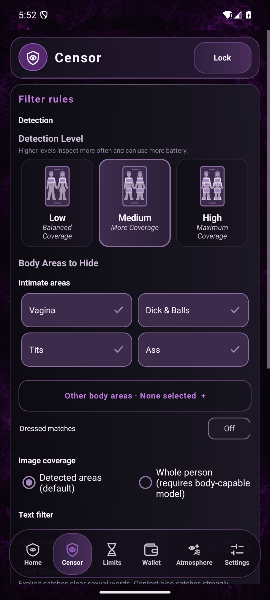
  &nbsp;&nbsp;
  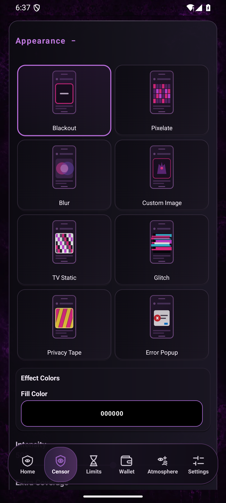
</p>

<details>
<summary><strong>Live image and text filtering examples</strong></summary>

<p align="center">
  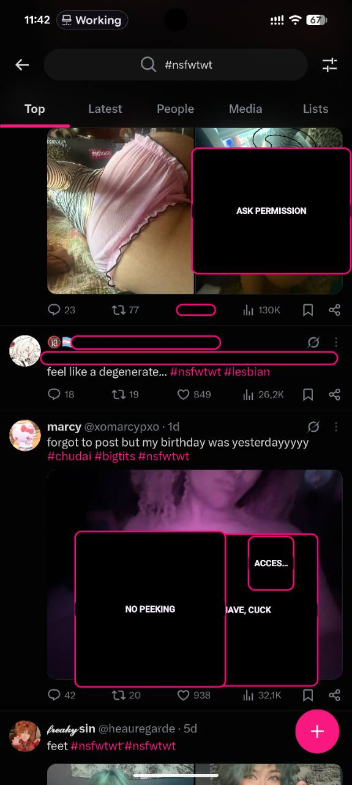
  &nbsp;&nbsp;
  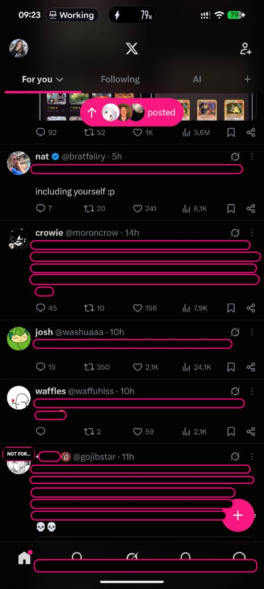
</p>

</details>

### Limits

Limits shows today's recorded app usage, a combined daily budget, and separate allowances beside each included app. Use either budget or both; the smaller remaining allowance applies. Usage resets at local midnight, and exhausted apps return to Home. Changing the included list preserves the day's recorded combined usage.

<p align="center">
  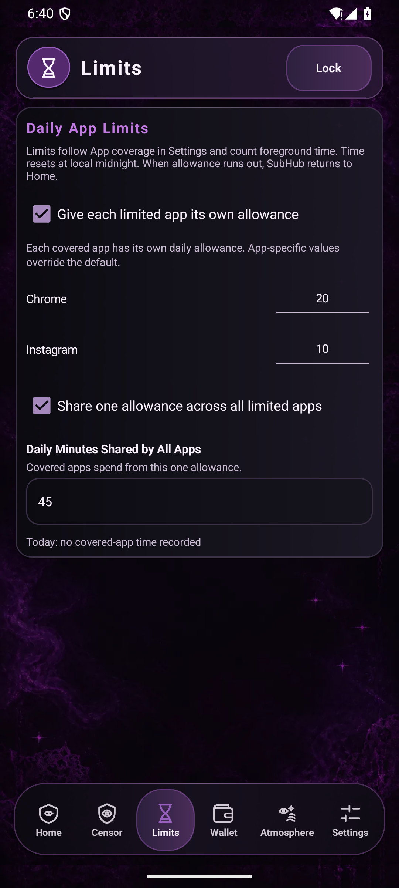
</p>

### Wallet / Tribute

Wallet is optional. Rules can count only deliberately enabled events: a new stable temptation, lingering on one still screen, tapping a visible censor, opening an included app, or a rate-limited Hardcore tamper signal. Every event is gated behind active service and the Wallet master switch.

Wallet places the amount due, payment action, and recent ledger in one compact overview. Dom opens Rules & caps, Paid pause, PayPal, or Corrections to configure them; Back returns to the overview. Review what is owed and settle it through PayPal. Merchant credentials and saved-wallet tokens are encrypted with Android Keystore and stay bound to the selected Sandbox or Live environment.

<p align="center">
  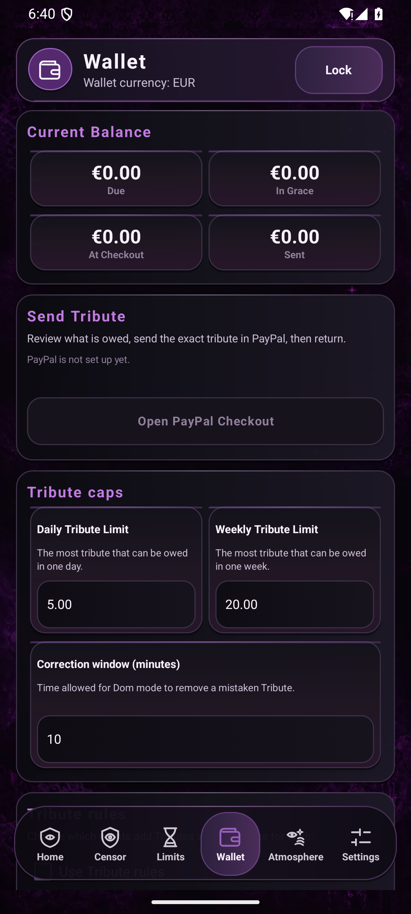
  &nbsp;
  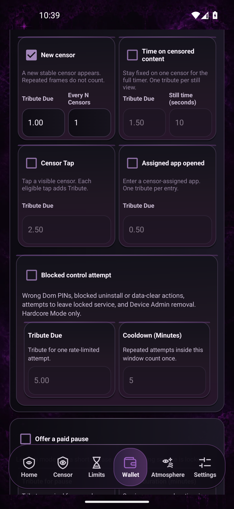
  &nbsp;
  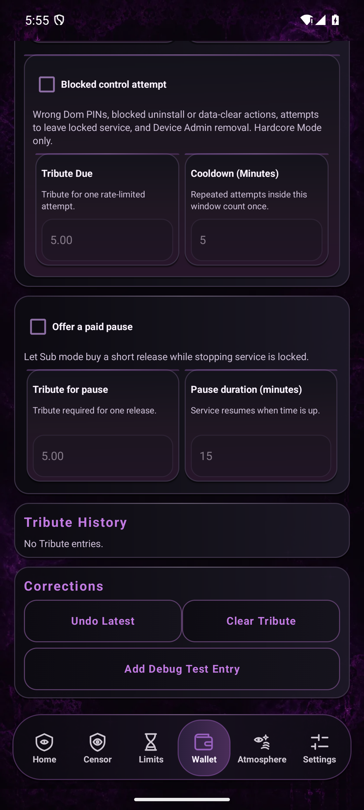
</p>

### Atmosphere

#### Subliminal Messaging

Faint randomized phrases can follow service through the shared included-app list. Obedience, focus, beta/cuck, findom, and custom phrase packs run through one touch-through Accessibility overlay—without waking the image detector. Presence, timing, text size, and voice are configured in Dom mode; Sub mode sees only the active summary.

Subliminal Messaging does not require Censor, Limits, or Wallet; each feature keeps its global enable control.

#### Popup Storm

Configure intensity, choose an image library, and try a bounded ten-second preview without enabling service participation. Popup Storm and Subliminal Messaging have separate controls on Rituals. Packs appear first, with direct Import and Library actions. Rituals also opens Achievements and Gallery Censor; Statistics stays on Home. Gallery offers a media preview, separate appearance and body-area editors, video position and export controls, and filename-based results. Exports keep originals unless deletion is explicitly selected.

<p align="center">
  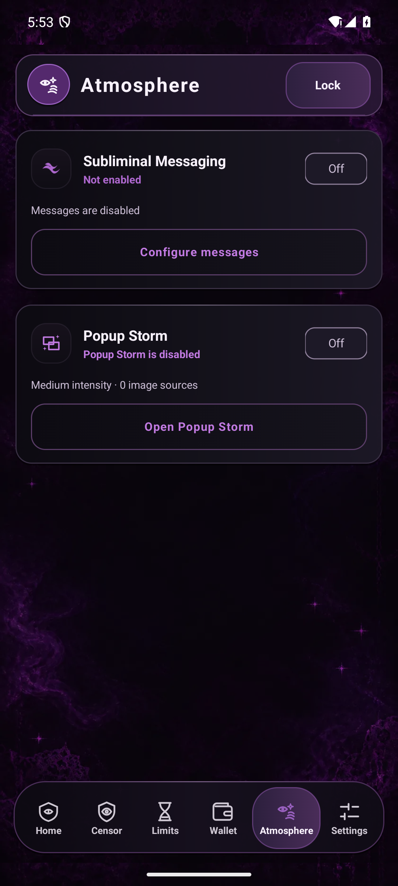
  &nbsp;
  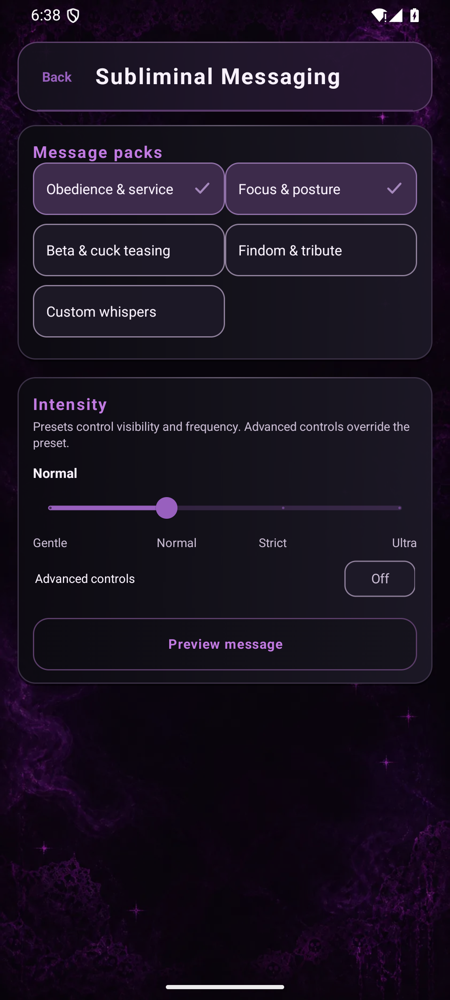
  &nbsp;
  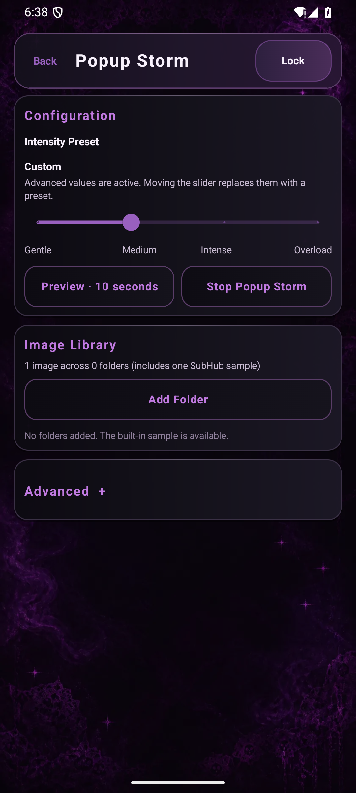
</p>

### Studio / Pack Maker

Studio is the portable pack creator built into SubHub, reachable from Rituals and as the last item in Settings → Features. Drafting a pack never changes live settings.

- Start with a blank draft, capture the current setup, or duplicate an existing arrangement.
- Use the four-step Details, Features, Images and Review editor. Configure each of the 114 transferable settings directly in the draft, copy a section from the current setup, or reset that section to defaults.
- Mix feature modules, Censor and text filters, generic Limits, tribute rules and caps, Subliminal Messaging, Popup Storm settings, and embedded private images. Preview/remove images and choose an optional cover.
- Use the shared color wheel and precise RGB sliders, with independent gradient endpoints.
- Autosave drafts, preview the result, import or export `.sub` files, and share them through Android’s standard share sheet.
- Review selected sections and a before/after summary before activation. Previous values are backed up locally and restored when the arrangement is deactivated or replaced.
- One pack can be active at a time. Dom mode is required to apply or restore settings; packs do not add a second setting-lock system. Creating and editing a draft is also available in Sub mode.

<p align="center">
  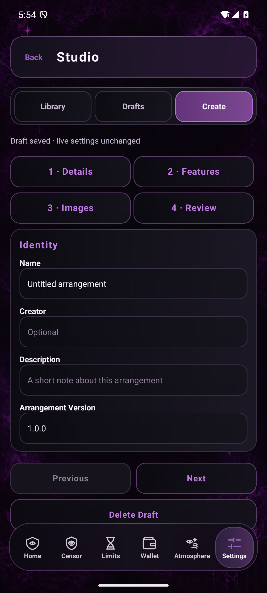
  &nbsp;
  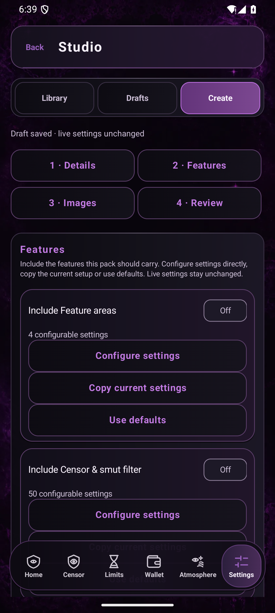
  &nbsp;
  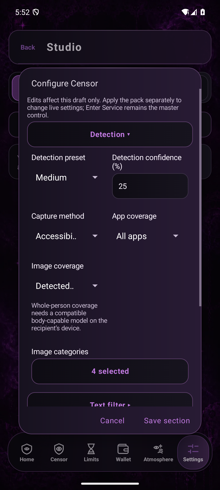
</p>

<details>
<summary><strong>Pack compatibility and privacy</strong></summary>

Security and duration fields are recommendations, never commands. Enter Service and Leave Service remain the master controls.

Ordinary sections never carry credentials, saved payer IDs, controller PINs, Android permissions, Device Admin state, app package assignments, active service state, history, statistics, achievements, Wallet currency or automatic-payment consent. Dom mode can explicitly add passphrase-encrypted merchant details; recipients must review and authorize them locally.

The old profile/backup and `.bbpack` interfaces are retired. Existing private saved files are not automatically deleted. See the [SubHub pack format](docs/subhubpack-format.md) for the schema and privacy boundary.

</details>

### Milestones

SubHub includes original illustrated achievements across censoring, protected time, sessions, streaks, customisation, App Mode, limits, service locks, Hardcore Mode, confirmed Wallet payments, and subliminal impressions. Related tiers keep one visual family and grow richer as the target rises.

<details>
<summary><strong>Open the complete badge collection</strong></summary>

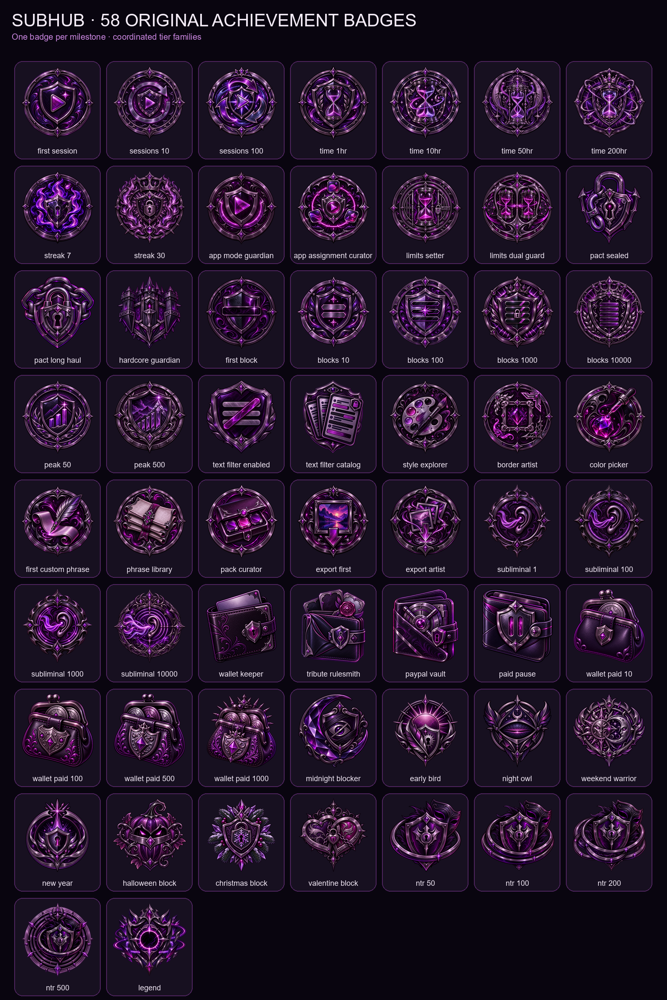

</details>

<p align="center"></p>

## How service works

Dom mode holds every rule. Sub mode keeps only the active scene: choose a service duration, enter service, and see the current limits, ledger, session, and milestones without exposing configuration.

| Dom mode | Sub mode |
|---|---|
| Configure modules, included apps, limits, censor appearance, Wallet rules, and Android access. | Start service, follow the timer, review active rules, and settle an enabled Wallet balance. |
| Protected by the controller PIN. | One focused Home surface with no edit fields; Home and Settings remain in the bottom navigation. |

A session begins when service starts—not when SubHub opens—and persists until service ends.

1. Install the universal APK, or the APK matching your device’s ABI, from [Downloads](https://github.com/confiteor48/SubHub/releases/latest).
2. Set the controller PIN and configure the participating features in Dom mode.
3. In Settings → Apps, choose the one included-app list. Each globally enabled service feature uses it. Settings groups Features, Apps, Privacy & permissions, and Help & about; grant the Android access required by the features you use.
4. Hand over to Sub mode, choose a duration, and enter service.

Disable a feature and it stops participating in service. Android permissions and the controller’s configuration remain separate from a pack or draft.

<p align="center"></p>

## Privacy & boundaries

- Detection and text classification run on-device; frames are processed in memory.
- Android remains the authority for Accessibility, screen capture, overlays, notifications, and Device Admin.
- Hardcore Mode adds platform-supported friction. It is not an unbreakable device-security boundary.
- Device Admin requests no wipe, camera, password, force-lock, or login-monitoring policy.
- Censor, Limits, and Wallet can each be removed from the experience.

## Build

Requirements: JDK 17, Android SDK 35, and Android 8.0 or newer.

```powershell
.\gradlew.bat testDebugUnitTest lintDebug assembleDebug
```

Editable source lives under `app/src/main/java/com/subhub/app/`. Versioned tags build, sign, verify, and publish universal and ABI-specific APKs with checksums.

Every push to a non-`master` branch also publishes a signed [GitHub prerelease](https://github.com/confiteor48/SubHub/releases), with a unique `-dev.<run>` version and the same APK/checksum/updater assets. Stable releases remain explicitly tagged from `master`; development builds never replace GitHub’s latest stable release.

In the app, open **Updates → Dev updates** in Dom mode to opt in. It is off by default. Checks follow the selected channel, and downloads and Android installation still require your approval. Turning Dev updates off keeps the installed app and waits for a newer stable build—no uninstall, ADB, or external file host is needed for subsequent updates.

## Screenshots & media kit

Browse the [complete current UI gallery](docs/screenshots/ui-map/README.md), including Dom/Sub navigation, app inclusion, Appearance, Wallet, Atmosphere, and all four Pack Maker steps. Captures use synthetic data on an Android emulator and show the development build; the published APK may differ.

Ready-to-share marketing materials:

- [Square collage — 1080 × 1080](docs/marketing/subhub-social-square.png)
- [Portrait collage — 1080 × 1350](docs/marketing/subhub-social-portrait.png)
- [Wide desktop collage — 1920 × 1080](docs/marketing/subhub-social-wide.png)
- [Editable SVG sources and regeneration instructions](docs/marketing/README.md)

The square and portrait collages feature Censor, Tribute, and Subliminal Messages. The desktop version adds Limits and Pack Maker. All use genuine app screenshots.

## Documentation

- [Architecture](docs/architecture.md)
- [Device smoke test](docs/device-smoke-test.md)
- [PayPal setup](docs/paypal-setup.md)
- [PayPal settlement](docs/paypal-penance.md)
- [Client-only roadmap](docs/client-only-roadmap.md)
- [SubHub pack format](docs/subhubpack-format.md)

<p align="center"></p>

<p align="center">
  <strong>SubHub</strong><br />
  Private control. Clearly handed over.
</p>
