# Current UI gallery

Real Android UI captures from October 8, 2026. These use synthetic emulator data, not a personal phone or live payment account. They show development build 0.6.4 (20), based on `64ba54df`, and may differ from the latest published APK.

The capture suite covers 42 screenshots: 34 distinct page/state captures below and eight repeated foundation/navigation checks. Screenshots document appearance and navigation, not live detection accuracy, scrolling performance, or payment execution.

## Home & controller spaces

  <a href="page-map/00-sub-home.png">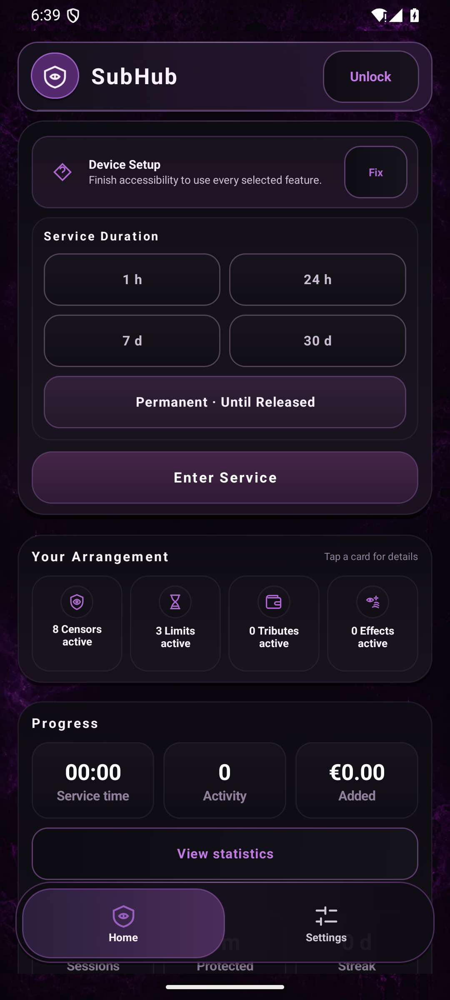</a>
  <a href="page-map/01-dom-home.png">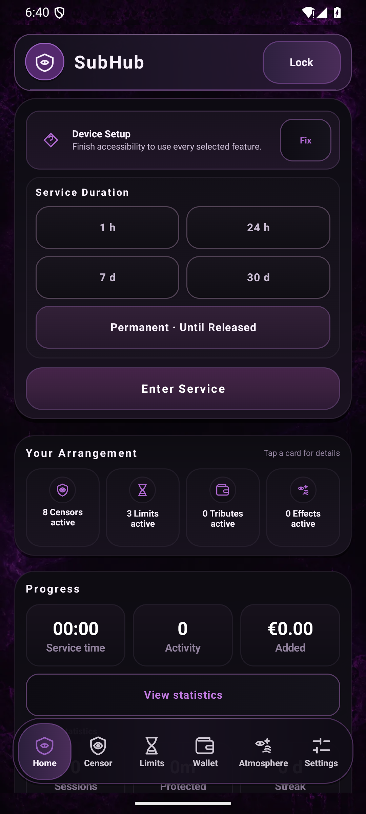</a>

## Settings & app assignments

  <a href="page-map/00b-sub-settings.png">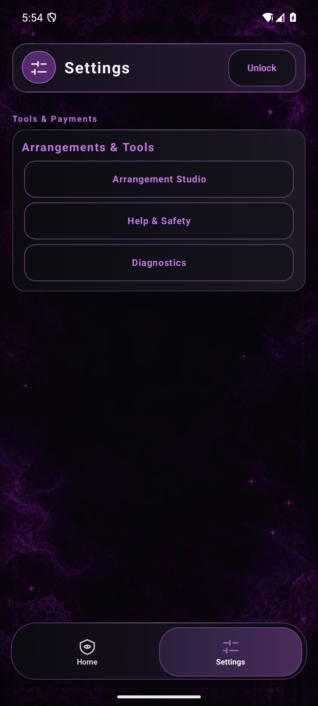</a>
  <a href="page-map/04-global-settings.png">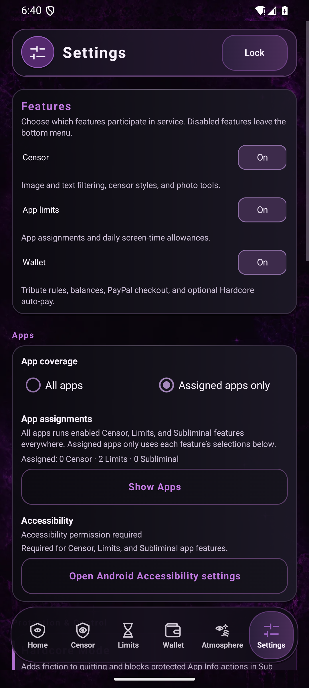</a>
  <a href="page-map/04b-app-assignments.png">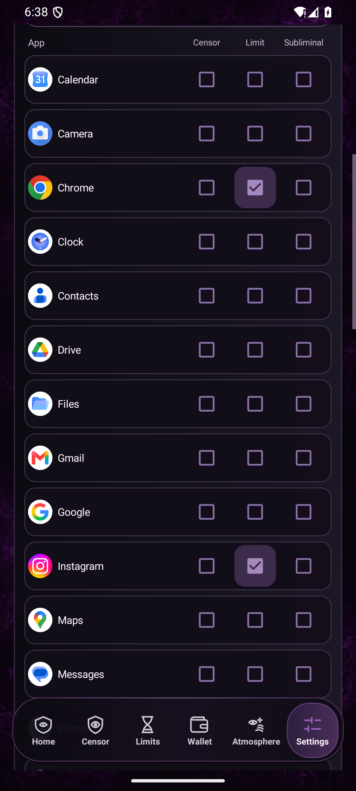</a>

## Censor & appearance

  
  
  <a href="page-map/05b-settings-detection-categories.png">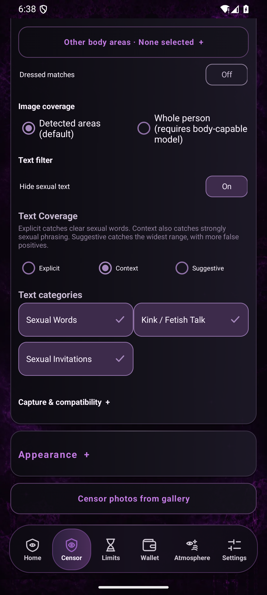</a>
  <a href="page-map/05c-settings-phrases-and-tools.png">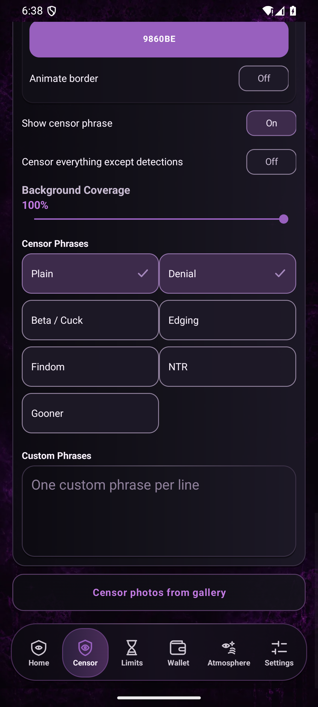</a>
  <a href="page-map/07-censor-photos.png">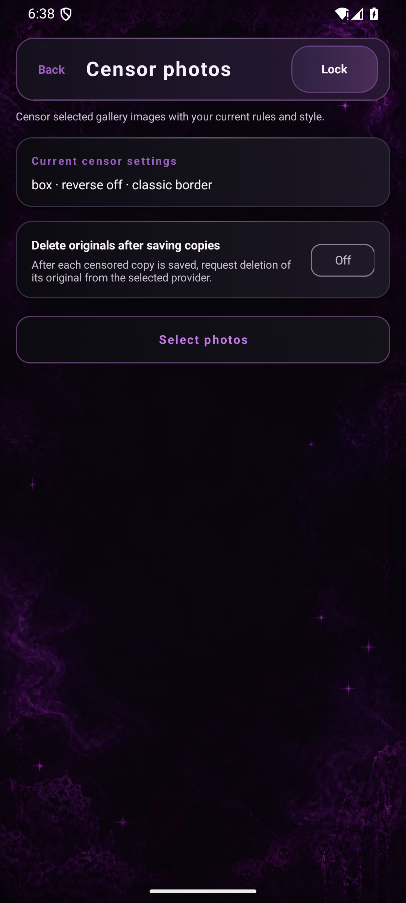</a>
  <a href="page-map/11-custom-images.png">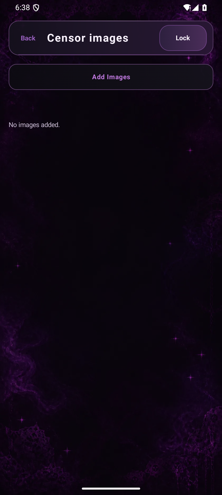</a>
  <a href="page-map/21-color-wheel.png">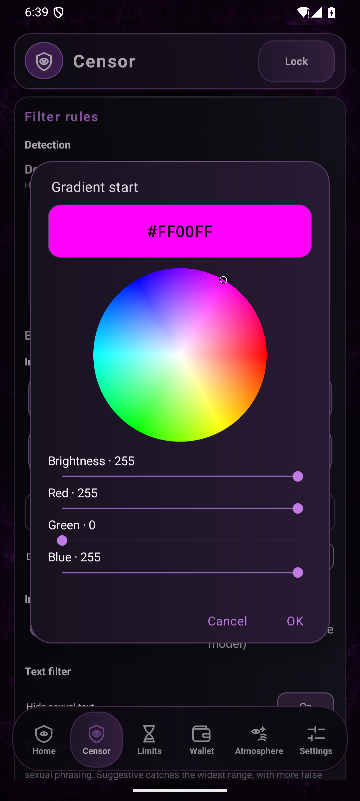</a>

## Limits & Wallet

  
  
  
  

## Atmosphere

  
  
  

## Pack Maker

  <a href="page-map/00c-sub-arrangements.png">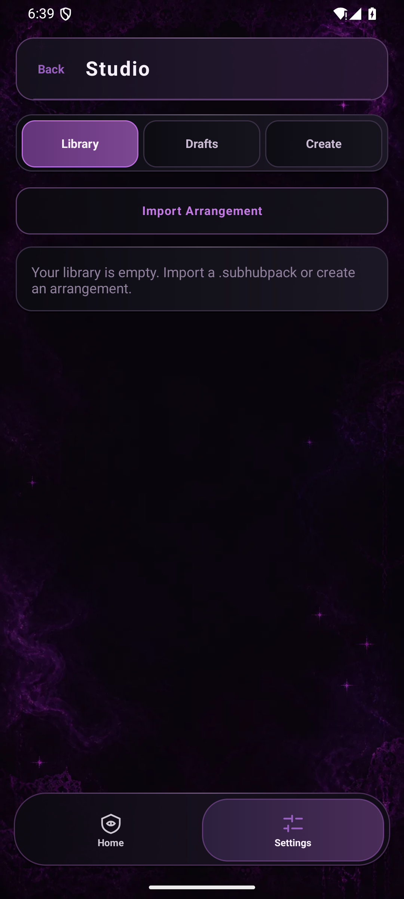</a>
  <a href="page-map/17-studio-library.png">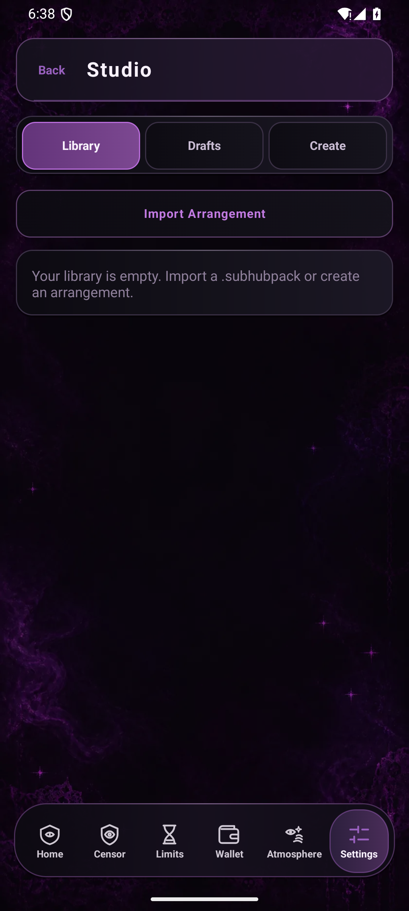</a>
  <a href="page-map/17b-studio-drafts.png">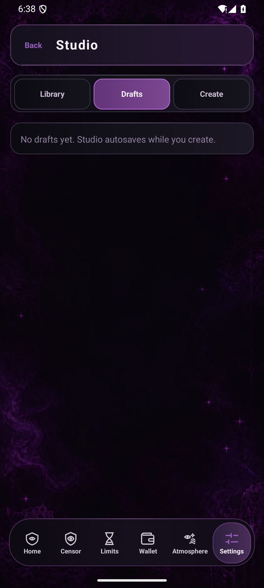</a>
  <a href="page-map/17c-studio-create.png">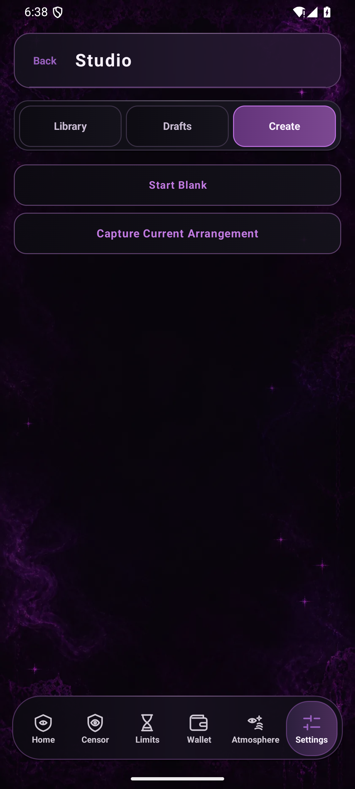</a>
  
  
  <a href="page-map/24-wizard-images.png">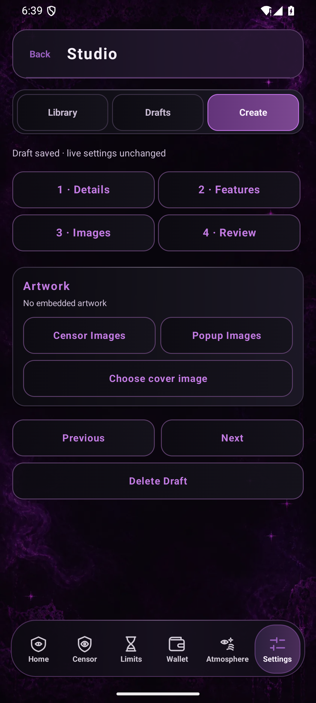</a>
  <a href="page-map/25-wizard-review.png">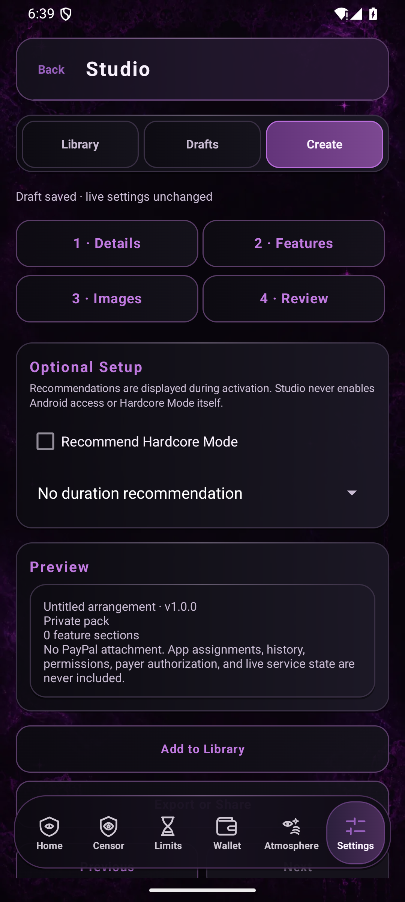</a>
  

## Progress & support

  <a href="page-map/09-statistics.png">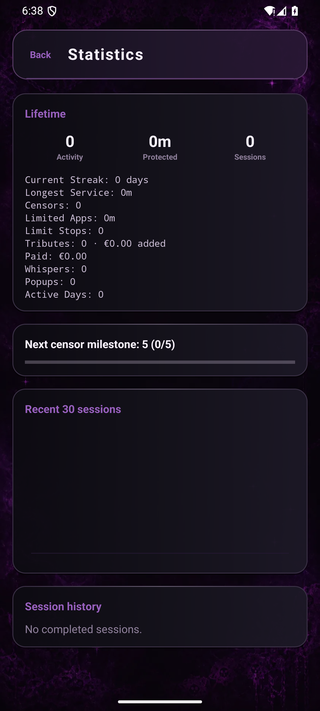</a>
  <a href="page-map/10-achievements.png">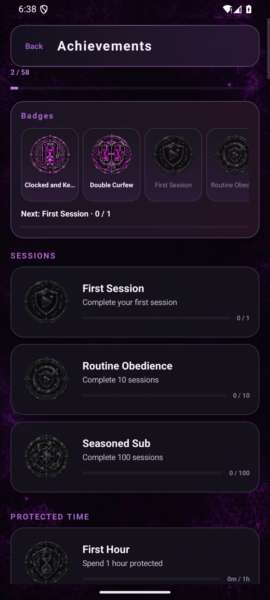</a>
  <a href="page-map/08-help-safety.png">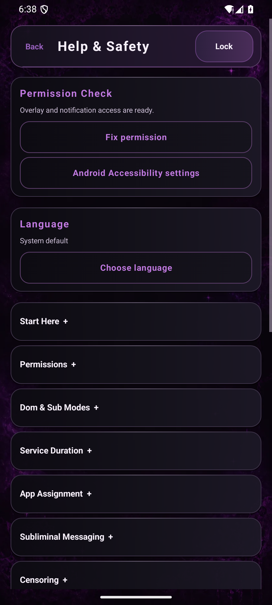</a>
  <a href="page-map/18-updates.png">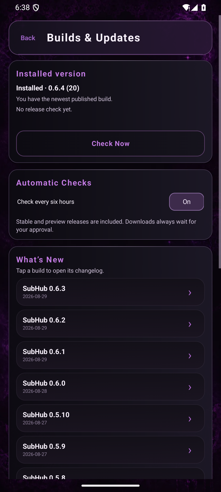</a>
  <a href="page-map/19-diagnostics.png">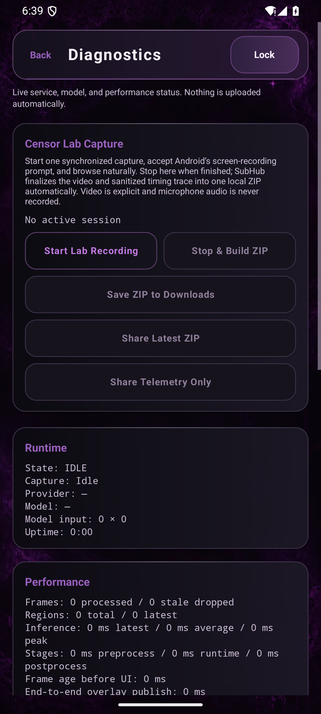</a>
  <a href="page-map/20-service-lock.png">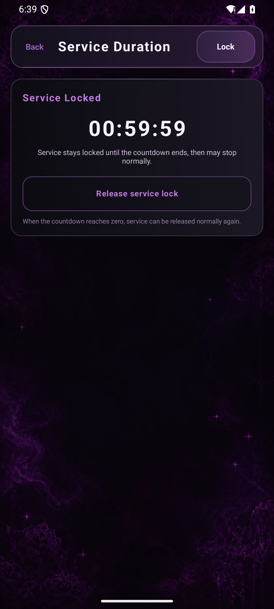</a>

## Capture verification

Use meaningful synthetic configurations in every future documentation pass. Limits must show one or two selected installed apps with distinct custom daily allowances, seeded and asserted by the reusable capture test. This set shows Chrome at 20 minutes, Instagram at 10 minutes, and a 45-minute shared allowance.

Both the application and instrumentation APK were built together from an exact, isolated source snapshot. The capture runner asserts named panels/dialogs, waits for asynchronous app rows and compositor settling, and scrolls to named sections. Each published image was visually reviewed. See [capture provenance](capture-provenance.json) for the source tree, emulator, dimensions, capture checks, and SHA-256 inventory.

Foundation checks: [Dom Home](page-map/foundation-01-dom-home.png), [Censor](page-map/foundation-02-censor.png), [Limits](page-map/foundation-03-limits.png), [Wallet](page-map/foundation-04-wallet.png), [Atmosphere](page-map/foundation-05-atmosphere.png), [Dom Settings](page-map/foundation-06-settings.png), [Sub Home](page-map/foundation-07-sub-home.png), and [Sub Settings](page-map/foundation-08-sub-settings.png).
