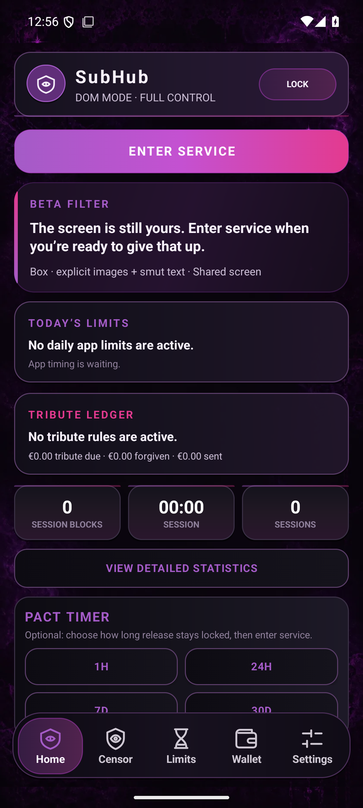
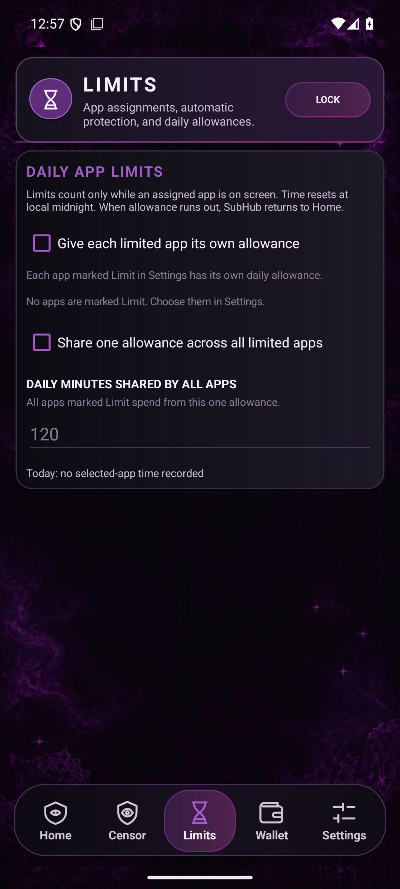
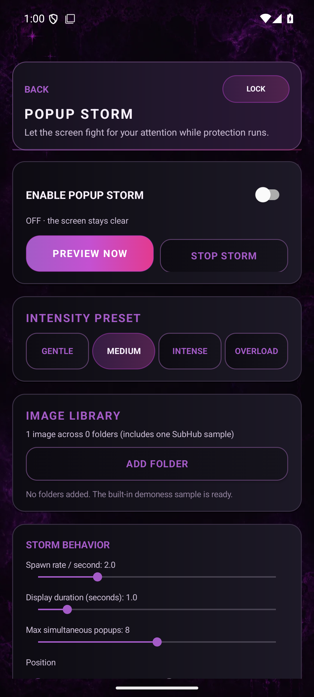
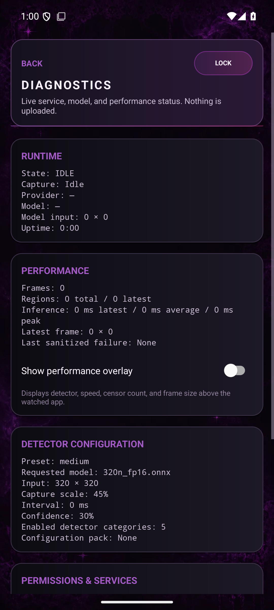
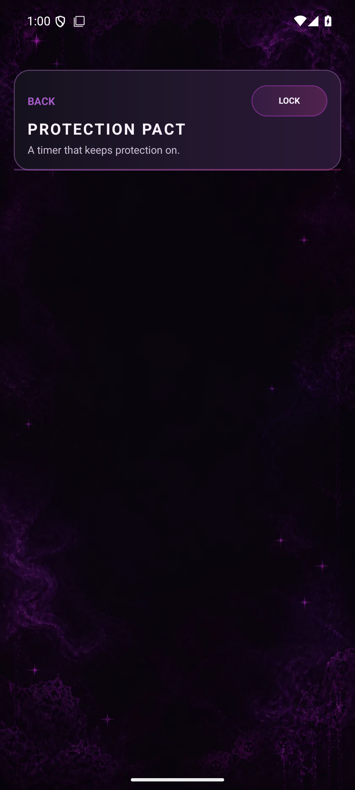

# SubHub UI page map

This inventory is captured from the real debug app on an Android 15 phone-sized emulator. It is kept in the repository so visual changes can be compared against an actual rendered baseline instead of inferred from layout XML.

## Core experience

| Home | Limits | Assigned apps |
|---|---|---|
|  |  |  |

## Wallet

| Overview | Rules and boundaries | Checkout and history |
|---|---|---|
|  |  |  |

## Configuration and censoring

| Global settings | Censor styles | Detection categories |
|---|---|---|
|  |  |  |

| Phrases and tools | Photo censoring |
|---|---|
|  |  |

## Review, safety, and supporting tools

| Help and safety | Statistics | Achievements |
|---|---|---|
|  |  |  |

| Custom images | Profiles | Configuration packs |
|---|---|---|
|  |  |  |

| Popup storm | Diagnostics | Service lock |
|---|---|---|
|  |  |  |

## Refreshing the map

Run `PageMapScreenshotTest` on a phone-sized Android emulator, then copy the resulting `page-map` folder from the app's external files directory into `docs/screenshots/ui-map`. Review the screenshots at original size before accepting UI changes; the test passing proves the pages render, but it cannot judge clipping, hierarchy, or polish.
